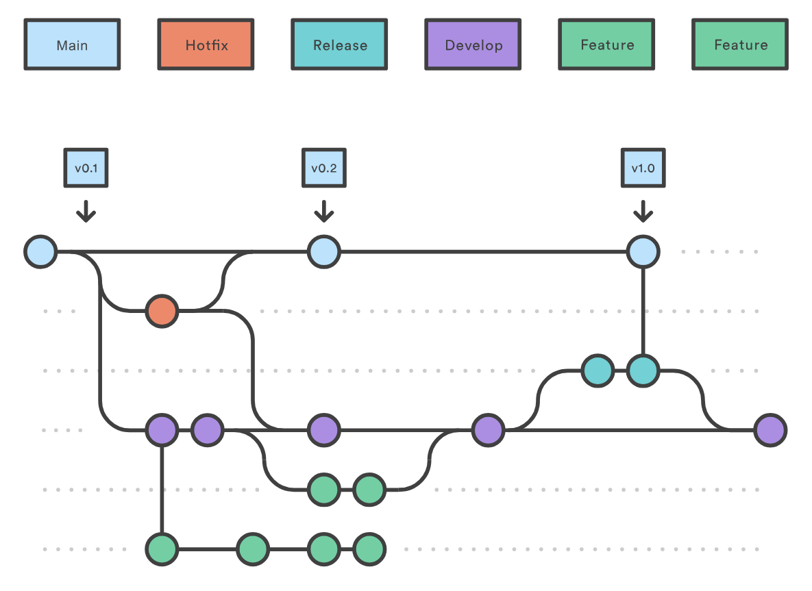

# Stage verslag Onetribe
## _Jop Molenaar, 500880472, CMD Amsterdam_

    Functie: Front-end developer
    Docentbegeleider: Anne Marleen Olthof
    Bedrijfsbegeleider: Michael Post, full-stack developer
    Datum: <!-- oplevering datum-->

## Inleiding

<!-- geef aan waarom je stage hebt gelopen bij dit bedrijf. Hoe ben je bij dit
bedrijf terecht gekomen? Hoe is de stage je bevallen? De inleiding moet de lezer
prikkelen om verder te lezen -->

## Omschrijving van het stage bedrijf

<!-- Plaatjes enzo -->

Onetribe is een bedrijf in de houthavens (Amsterdam) dat gefocust is op het maken van websites met een extra oog op een goede gebruikerservaring. Ze gebruiken vooral Nuxt.js en Vue.js voor hun projecten maar aangezien ze een tijd geleden zijn gefuseerd met noprotocol hebben ze ook een aantal projecten met twig en php. Aangezien ze Nuxt.js en Vue.js gebruiken  voor hun projecten zijn er weinig backend developers nodig. De organisatiestructuur bestaat uit een aantal afdelingen. Hier werken visual designers, user experience designers, veel front-end developers, een aantal backenders, contentmakers, copywriters en projectmanagers. 
Ik heb dit bedrijf gevonden door te browsen op het internet. Na wat rondgekeken te hebben op de website sprak dit bedrijf mij al erg aan. Dit komt doordat ze extra aandacht geven aan wat een website echt goed en compleet maakt. Hierbij horen bijvoorbeeld responsiveness, toegankelijkheid en performance en zagen de projecten die ze hadden gemaakt er aantrekkelijk uit. Ook is dit een groter bedrijf dan waar ik eerder stage heb gelopen en dit geeft mij de mogelijkheid om te kunnen vergelijken. Onetribe maakt ook gebruik van frameworks en dit is iets waar ik nog geen ervaring mee heb, en weet zeker dat ik daar veel van kan leren.  

## Profielschets bedrijfsbegeleider

Mijn bedrijfsbegeleider is Michael Post en is een full-stack developer bij Onetribe en personal trainer. Hij heeft CMD gestudeerd en daarnaast functies gehad als front-end developer en project manager. Hij kan mij zeker wat leren aangezien hij veel ervaring en kennis heeft in het vak en aan dezelfde (soort) projecten werkt als ik tijdens mijn stage. 

## Jouw functieomschrijving

Mijn functie die ik ga uitvoeren is front-end developer. Hierbij ga ik meewerken aan projecten op basis van Nuxt.je en Vue.js en kan ik worden gevraagd om werk te testen en aan te geven waar er verbeteringen gemaakt moeten worden of zelf te verbeteren. Deze projecten zijn voor bedrijven zoals Peakz padel. De gebruiker moet op deze websites vaak informatie kunnen vinden en bepaalde acties kunnen ondernemen waar de service voor bedoeld is zoals iets kopen of boeken. 
Het team waarin ik kom te werken zijn vooral andere developers, designers, UX’ers, en project managers.

## Werkzaamheden

<!-- wat heb je concreet gedaan. Een uitgebreide beschrijving van de
jouw werkzaamheden en van jouw gemaakte beroepsproducten. Laat afbeeldingen
zien van wat je hebt gemaakt en het proces erachter. TIP: Gebruik hierbij het logboek
dat je tijdens je stage hebt bijgehouden -->

  ### Werkwijzen Onetribe

  Aangezien Onetribe gefuseerd is met noprotocol hebben ze nu nog meerdere werk-omgevingen en manieren voor de versie beheer. Ik dacht eerst dat er meerdere manier waren maar uiteindelijk kwam ik erachter dat ze allemaal de git flow manier willen aanhouden. Hierbij wordt de versie van je applicatie automatisch geupdate aan de hand van wat je in je commit messages zet. Ook worden de branches automatisch in een map geordend aan de hand van wat je voor je branch zet. Naast git flow heb ik ook geleerd dat ze de commit messages in voltooide tijd schrijven, dit is handig want dan leest diegene die het reviewed wat die changes gaan doen en niet wat ze al gedaan hebben, want dat is niet zo. 

  #### Git flow

  Om de versie beheer goed inzichtelijk te houden maken ze gebruik van git flow.
  Je zet `feature/`, `hotfix/` of `release/` voor de titel van je branch als je die cloned en de titel van je commit is eigenlijk vaak ook je issue nummer. Welke het meest wordt gebruikt is `feature/`.
  Voor de semantic release (het versienummer van je project die je automatisch kan updaten aan de hand van hoe je je commits opbouwt) moet je je commits beginnen met chore:, fix:, feature: of perf:. 
  voorbeelden:

  

  > Bron: https://www.atlassian.com/git/tutorials/comparing-workflows/gitflow-workflow 

  Ook zei Raoul dat niet iedereen zich aan de standaard van git flow houdt en vind dat je je gewoon aan de standaard moet houden en niet dingen er bij moet verzinnen die je dan eerst weer moet uitleggen. 

  #### Code enviroments & andere tools

  Bij Onetribe gebruiken ze Bitbucket en Github om hun code op te slaan. Dit verschilt per project door de fusering met noProtocol. 

  - Jira -> Issue boards
  - Sentry -> debug, errors etc?????
  - Algolia -> search functies ???
  - Dato, Craft cms -> content management system
  - Heroku -> Database?
  - Extra widgets zoals FOYS of localfocus -> hiermee komt vaak de klant mee aanzetten. Hier kiest Onetribe dus niet perse voor, en hebben dus ook vaak problemen door bugs bij de andere partij. 

  #### Vue.js/Nuxt.js Onetribe

  Veel projecten maken gebruik van het Vue.js/Nuxt.js framework. Dit was helemaal nieuw voor mij dus dit was erg interessant. 
  Wat ik meteen al zag is dat dit erg component based wordt geschreven. Je hebt pages, en die bestaan uit components, en sommige components bestaan weer uit andere components. Door data door te geven en te kijken of bepaalde dingen moeten worden ingeladen als het nodig is, kun je dus met dezelfde componenten verschillende pagina's maken, zonder veel code duplication. Ook hebben deze componenten hun eigen component based styling en scripts. 
  <!-- meer voorbeelden en code hieronder -->

## Leerdoelen

  ### Samen ontwerpen

  ### Prototypen en uitwerken

  ### Evalueren

  ### Oriënteren en begrijpen

  ### Verbeelden en conceptualiseren

## Observatieopdrachten

## Analyse feedbackformulieren 

## Reflectie

## Bijlagen

