# Stage verslag Onetribe
## _Jop Molenaar, 500880472, CMD Amsterdam_

    Functie: Front-end developer
    Docentbegeleider: Anne Marleen Olthof
    Bedrijfsbegeleider: Michael Post, full-stack developer
    Datum: <!-- oplevering datum-->

## Inleiding

<!-- geef aan waarom je stage hebt gelopen bij dit bedrijf. Hoe ben je bij dit
bedrijf terecht gekomen? Hoe is de stage je bevallen? De inleiding moet de lezer
prikkelen om verder te lezen -->

## Omschrijving van het stage bedrijf

<!-- Plaatjes enzo -->

Onetribe is een bedrijf in de houthavens (Amsterdam) dat gefocust is op het maken van websites met een extra oog op een goede gebruikerservaring. Ze gebruiken vooral Nuxt.js en Vue.js voor hun projecten maar aangezien ze een tijd geleden zijn gefuseerd met noprotocol hebben ze ook een aantal projecten met twig en php. Aangezien ze Nuxt.js en Vue.js gebruiken  voor hun projecten zijn er weinig backend developers nodig. De organisatiestructuur bestaat uit een aantal afdelingen. Hier werken visual designers, user experience designers, veel front-end developers, een aantal backenders, contentmakers, copywriters en projectmanagers. 
Ik heb dit bedrijf gevonden door te browsen op het internet. Na wat rondgekeken te hebben op de website sprak dit bedrijf mij al erg aan. Dit komt doordat ze extra aandacht geven aan wat een website echt goed en compleet maakt. Hierbij horen bijvoorbeeld responsiveness, toegankelijkheid en performance en zagen de projecten die ze hadden gemaakt er aantrekkelijk uit. Ook is dit een groter bedrijf dan waar ik eerder stage heb gelopen en dit geeft mij de mogelijkheid om te kunnen vergelijken. Onetribe maakt ook gebruik van frameworks en dit is iets waar ik nog geen ervaring mee heb, en weet zeker dat ik daar veel van kan leren.  

## Profielschets bedrijfsbegeleider

Mijn bedrijfsbegeleider is Michael Post en is een full-stack developer bij Onetribe en personal trainer. Hij heeft CMD gestudeerd en daarnaast functies gehad als front-end developer en project manager. Hij kan mij zeker wat leren aangezien hij veel ervaring en kennis heeft in het vak en aan dezelfde (soort) projecten werkt als ik tijdens mijn stage. 

## Jouw functieomschrijving

Mijn functie die ik ga uitvoeren is front-end developer. Hierbij ga ik meewerken aan projecten op basis van Nuxt.je en Vue.js en kan ik worden gevraagd om werk te testen en aan te geven waar er verbeteringen gemaakt moeten worden of zelf te verbeteren. Deze projecten zijn voor bedrijven zoals Peakz padel. De gebruiker moet op deze websites vaak informatie kunnen vinden en bepaalde acties kunnen ondernemen waar de service voor bedoeld is zoals iets kopen of boeken. 
Het team waarin ik kom te werken zijn vooral andere developers, designers, UX’ers, en project managers.

## Werkzaamheden

<!-- 
Wat heb je concreet gedaan. Een uitgebreide beschrijving van de
jouw werkzaamheden en van jouw gemaakte beroepsproducten. Laat afbeeldingen
zien van wat je hebt gemaakt en het proces erachter. TIP: Gebruik hierbij het logboek
dat je tijdens je stage hebt bijgehouden.

- uitgebreide beschrijving van 
-- mijn werkzaamheden
-- jouw gemaakte beroepsproducten (afbeeldingen + proces)
-->

Ik heb tijdens mijn stage meegewerkt aan meerdere projecten waaronder Peakz padel, Oba congres en oba leef en leer. Vista hypotheken, De Rijke Noordzee, en natuurlijk het grootste project van de hele stage waaraan ik heb gewerkt: Patientenfederatie. 

Aan het begin van de stage werd ik op Peakz padel gezet dat in zijn laatste fase zat van de development faze. Hier kon ik nog de laatste features bouwen en vooral bugs oplossen en inkomen in het leren van een nieuw framework namelijk vue.js/nuxt.js, maar ook alle andere systemen en flows waar Onetribe gebruikt van maakt. Hierbij kwam ik ook als eerst in aanraking met standups met verschillende disciplines bij elkaar. Voor Peakz padel heb ik veel contact gehad met andere disciplines om het product dat bijna zou worden opgeleverd nog iets beter te maken. Zo heb ik bijvoorbeeld ook input kunnen gegeven bij problemen zoals het weinig ruimte over hebben in de navigatiebalk nadat de Duitse vertalingen van peakz padel .de binnen kwamen. Maar op dit project heb ik ook wat kunnen bijdragen aan het verbeteren van de user experience van de formulieren om events aan te vragen via de website. Op de website waren namelijk knoppen die naar hetzelfde formulier gingen, maar wel de gebruiker al een keuze liet maken over een bepaalde vraag in het formulier. Dit werd alleen nog niet meegenomen in het formulier zelf. Na wat research naar Noteforms kon ik deze feature implementeren en zorgde ik ervoor dat de manier waarop de klant dit later zelf kon doen duidelijk was. Dit ben ik ook nog een keer nagegaan bij een project manager. 

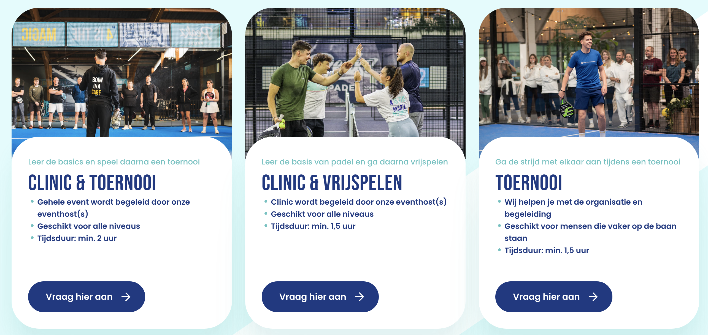

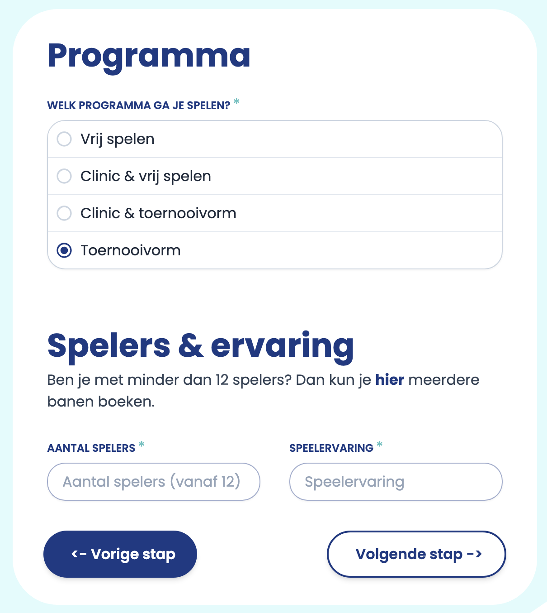

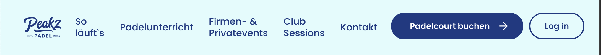

Bij Oba leef en leer heb ik mijn nieuwe vue kennis kunnen toepassen op wat complexere problemen. Zo heb ik mij bijvoorbeeld kunnen verdiepen in een bug waar een afbeelding op bepaalde breakpoints super klein werd.

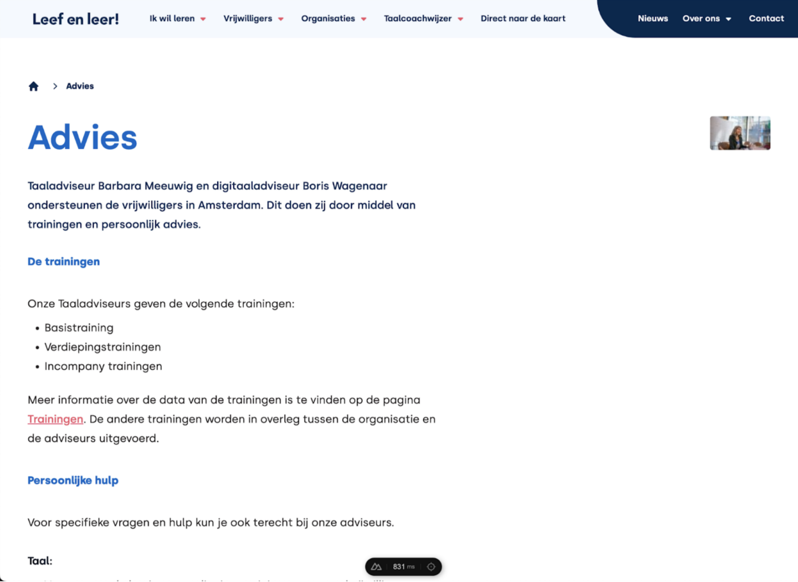

Maar ook kunnen bezig houden aan een probleem met de filter functie op locaties op de website. Bij een filter optie op de website lukte het niet om op bepaalde filters te filteren. De website van Onetribe handelde alles goed af, maar het lag juist aan de service die werd gebruikt om te filteren. Die gaven namelijk niet de goede url terug van de kaart met alle gefilterde locaties. Om verwarring voor de gebruiker te voorkomen heb ik in de code de betreffende filters uitgecommend (zodat dit niet opnieuw moet worden geschreven door een developer), en een comment erboven toegevoegd over waarom het is uitgecommend. 

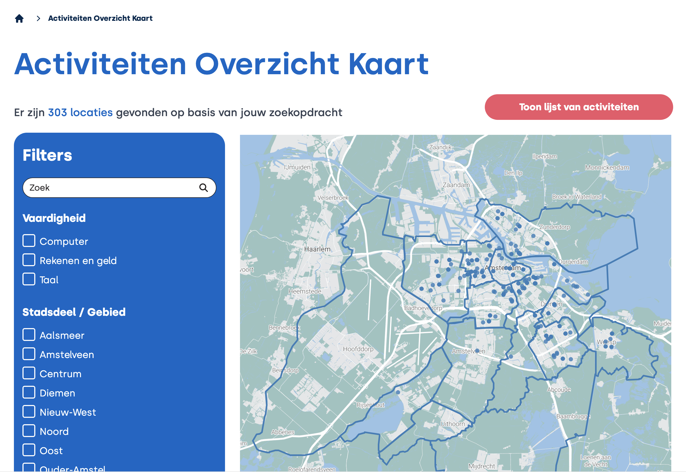

Daarna heb ik nog wat aanpassingen gedaan zodat:

- De gebruiker niet verward raakt als er filters verdwijnen en nog in de url staan. 
- De kaart altijd resultaat krijgt ook al wordt een gebroken error gebruikt. 
- De gebruiker terug kan gaan naar zijn orginele filters op de andere pagina (geschiedenis onthouden)

Hier moest ik wat voor experimenteren om het met zo’n klein mogelijke en goede aanpassingen voor elkaar te krijgen. 

Uiteindelijk heb ik hiervoor een aparte functie gemaakt. Deze functie controleert of er andere filters in zitten die de map niet kan hendelen. Deze haalt hij er zo nodig uit. Daarna geeft hij de uiState weer terug. Echter had ik wel de oude uiState nodig om de geschiedenis te behouden. Dit heb ik in de updateUrlPath functie gewijzigd. 

Ook heb ik de functie gebruikt om de uiState te cleanen zodat het niet wordt gebruikt voor gebroken filters om de map daarop te zetten. Als er bijvoorbeeld dan een alleen staande gebroken filter is dan laad de kaart niks.

Ik had er ook voor kunnen kiezen die uit de functie te verwijderen. Maar aangezien ik toch al een functie had gemaakt om deze eruit te filteren (mede om de url en geschiedenis goed te krijgen) kan ik deze ook gewoon gebruiken. 
Wel heb ik de filterblokken op de pagina uitgecomment voor het geval dat ze straks wel gaan werken. 

En ik heb comments toegevoegd. Dit leek mij wel zo netjes en handig 

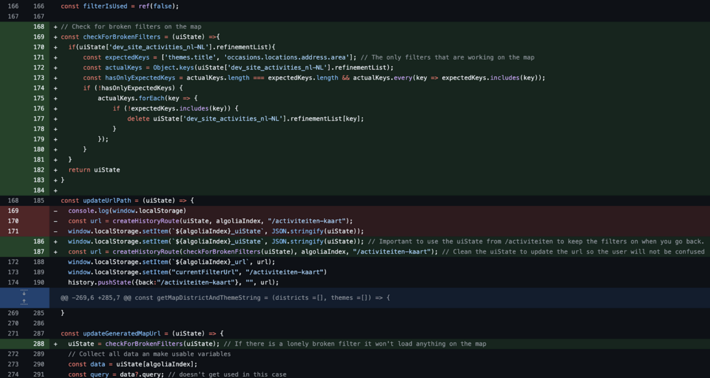

Halverwege mijn stage kreeg ik de opdracht om de logica van een formulier voor vista hypotheken werkend te krijgen en te verfijnen. Er was namelijk een verzoek vanuit de klant om een structuurwijziging in het formulier door te voeren. Hiervoor was een vraag in het formulier nodig die drie keer genest werd en dat kon het formulier hoe het was gebouwd niet aan. Er moest dus nieuwe logica geschreven worden en goede oplossingen bedenken die de user experience aanzienlijk zouden verbeteren. Waar ik onderandere rekening mee moest houden was: extra lagen toevoegen aan het formulier en die velden kunnen tonen, de extra velden kunnen valideren voor onder onder andere meerdere type vragen (radios, checlboxes, text) in de diepere lagen, geneste antwoorden kunnen verwijderen als je een laag erboven iets veranderd en error meldingen voor die geneste velden kunnen laten zien. Ook moest ik rekening houden voor de validatie dat als gebruikers zich bedenken, antwoorden kunnen zijn ingevuld op plekker waar dat niet moet. Deze moet ik dus tijdens het invullen van het formulier in de gaten houden en verwijderen als het nodig is. 

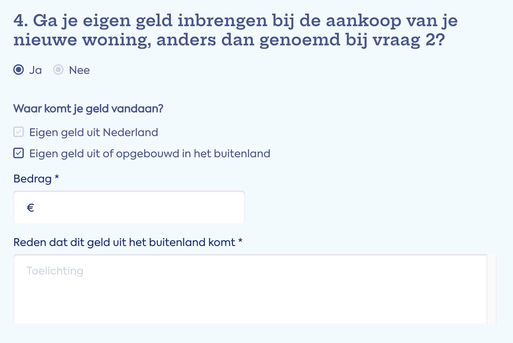

---

Door de hele stage heen heb ik aan meerdere projecten gezeten en dit betekende ook dat ik meerdere verschillende projecten lokaal heb moeten opzetten om er aan te kunnen werken. Dit ging niet altijd heel soepel en hier had ik vaak hulp bij nodig. Meer hierover heb ik beschreven onder het kopje "Opzetten projecten", te lezen in de bijlagen. Projecten moeten op bepaalde momenten ook gedeployed worden zodat het live komt te staan. Dit heb ik ook een aantal keer mogen doen voor Oba congres en de Rijke Noorzee. Na een GO van de klant mocht ik samen met een andere developer alle stappen doorlopen die nodig waren om de website op de juiste manieren volgens de standaarden van Onetribe te deployen. Meer hierover en over de versie nummers van de website en de deploy stappen staan in de bijlagen onder "Git flow" en "Git flow deployment".

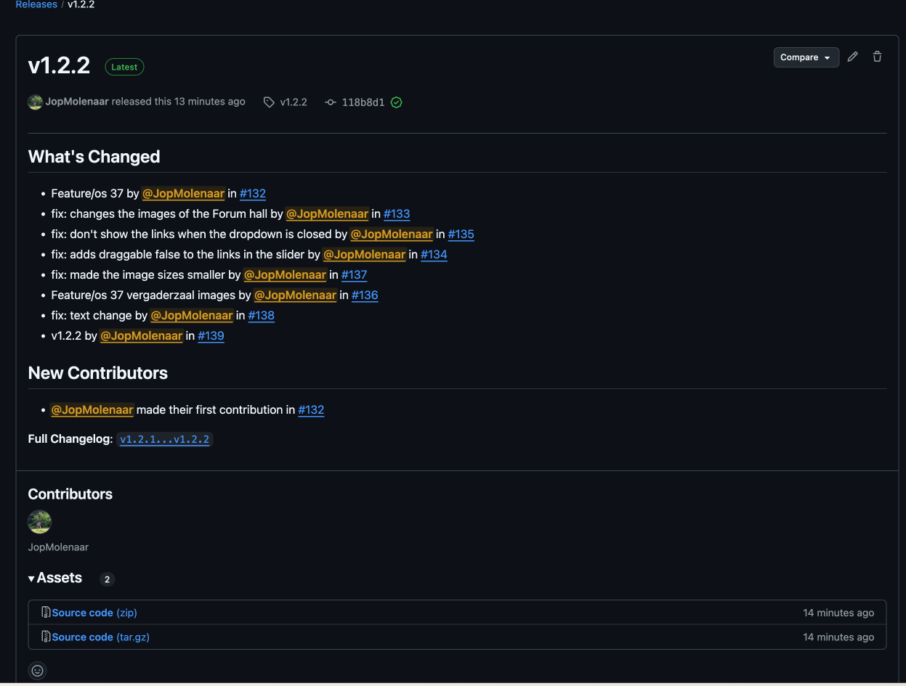

Maar waar ik mij het grootste deel van de stage bezig mee heb gehouden is het actief meedoen aan een groot project voor Patientenfederatie. Ik werd hier op gezet toen het nog vol in de design fase zat, en kwam bij meetings te zitten waar werd besproken wat voor techstack het zou krijgen, wat de bedoeling zou zijn, wat er allemaal qua functies was verkocht en wat de prioriteit was vanuit de klant. Ook konden we ons al inlezen in het design en vragen stellen over bepaalde onzekerheden. 

Uiteindelijk kreeg ik de opdracht om de content blokken, waarmee de contentbeheerders straks zelf een pagina mee kunnen samenstellen, te templaten en te stylen volgens het design. Dit was helemaal nieuw voor mij, zeker in de techstack die was gekozen namelijk het Craft cms met het .twig templating language en tailwind + tailgrids voor de styling. De bedoeling zou zijn dat de klant zo snel mogelijk content zou vullen zodra het mogelijk was om te gaan vullen. Pixel perfect design was dus nog niet aan de orde, dat kwam later.

Het bouwen van de blokken ging erg soepel en daar heb ik veel van geleerd. Wel bleek de keuze van tailwind en tailgrids niet de juiste te zijn geweest voor dit project. Deze tools zouden ook zijn gebruikt in figma waardoor het soepel en snel te stylen zou moeten zijn. Maar al snel kwam ik erachter dat de tailgrids components kopieren en aanpassen naar het design voor de developers niet echt handig was. De figma blokken verschilde te veel van de tailgrids blokken waardoor ik alles moest verwijderen en eigen styling moest toevoegen. Ook waren veel blokken met position absolute gestyled waardoor het niet repsonisive was als je elementen uit de blokken haalde. Het opzetten van de `tailwind.config` hebben we vooral gedaan met de aparte figma tabs zoals typography en colors. Maar uiteindelijk bleek dat het design van de homepagina daar niet helemaal op aansloot. Dit zorgde alsnog voor extra typografie styling op de html elementen.

Waar ik het meest van heb geleerd is de samenwerking met design in aanloop van de start van zo'n project. Ik had dit namelijk nog nooit gedaan en had dus ook niet de gedachte gehad om te kijken wat design nou precies had gemaakt. Dit leverde later wat onenigheid op dat de website nog niet pixel perfect was, en om dit te herstellen moest ik dus pixel perfect het design gaan inspecteren en hierdoor kwamen er een hoop vragen en opmerking naar boven over consistentie, welke versie nou de laatste was en over bijvoorbeeld semantiek. Uiteindelijk is dit recht getrokken door hier extra op te letten, drie dubbel te checken, en meetings in te plannen samen met design om door de testlinkjes heen te gaan om te kijken of ze nog afwijkende dingen zagen. 

Verder heb ik meer kunnen doen dan alleen blokken templaten en bouwen. Toen ik namelijk een beetje het Craft cms onder de knie kreeg en begreep, kon ik features toevoegen aan blokken voor UX redenen en structurele wijzigingen aan paginalayouts toebrengen om de website en straks het beheer aan de website te verbeteren. Wat belangrijke punten waren om rekening mee te houden tijdens het developen van deze website waren vooral de edge cases en het in de gaten houden van de accesibility en snelheid van de webiste. In dit laatste konden we makkelijk inzicht krijgen door de tool "pagespeed". Dit heb ik vaak gebruikt om de website te analyseren en te verbeteren. 

<!-- Afbeeldingen -->

---

Dit is natuurlijk een beknopte versie van wat ik allemaal heb gedaan en heb geleerd. Bepaalde overkoepelende processen die ik tijdens mijn werkzaamheden heb geleerd zoals de gitflow, het opzetten en deployen van projecten, nieuwe code enviroments & andere nieuwe tools kan je lezen in de bijlage. 

## Leerdoelen

<!-- 
In je stageplan heb je leerdoelen beschreven binnen je gekozen
competenties, reflecteer op je ontwikkeling aan de hand van je leerdoelen uit je
stageplan en hoe je je ontwikkeld hebt sindsdien. Wat zijn je belangrijkste leerpunten
van deze stage? En hoe heb je aangetoond dat je je leerdoelen hebt behaald. Geef
voorbeelden uit de projecten waar je aan gewerkt hebt. 

- Reflecteer op je ontwikkeling 
-- belangrijkste leerpunten
-- hoe aangetoond dat je ze hebt behaald (voorbeelden uit de projecten)

-->

  ### Samen ontwerpen

  **CMD’ers betrekken teamleden, gebruikers, domeinexperts en belanghebbenden in het ontwerp. Ze begrijpen de verhoudingen en zorgen dat iedereen zich gehoord voelt in het proces.**

  #### Mijn leerdoelen

  Wat ik wil leren en doen tijdens mijn stage dat aansluit aan de competentie “Samen ontwerpen” is meewerken aan projecten in een multidisciplinair team. Dit betekent meedoen aan stand-ups, input geven, feedback vragen en geven en bijvoorbeeld werk van andere functies te gebruiken om zo mijn taken te kunnen doen. 
  Ik ga ook vooral focussen en oefenen op communicatieve vaardigheden om de code goed over te kunnen brengen aan mensen die er niets of minder van weten dan ik. Dit helpt met mensen kunnen laten weten wat ik bijvoorbeeld heb gedaan en is bijvoorbeeld belangrijk voor klantencontact en stand ups met andere functies erbij. 

  #### Uitwerking

  Tijdens mijn stage bij Onetribe heb ik veel kunnen samenwerken met verschillende stakeholders binnen een team. Aan het begin werd ik op een project genaamd Peakz padel gezet, dat in zijn laatste development fase zat voor de officiele livegang. Wat voor mij meteen nieuw was was het samenwerken met verschillende project managers (voor development, klantcontact, externe partijen contact), designers, backend developers, developers en lead developers. Ook begon ik hier een nieuw framework te leren en heb ik veel feedback gekregen. 

  Aan het begin hadden we soms een standup maar naarmate het eind in zicht kwam werd dit iedere dag een standup waar de progressie even kort werd besproken. 

  - Communicatie naar pm'ers / klant / developers

  Ongeveer halverwege de stage mocht ik meewerken aan een project dat nog in de design fase zat maar alvast rustig naar de devlopment fase ging. Hier heb ik veel meetings van bij mogen wonen. Input geven in deze meetings vond ik lastig omdat dit allemaal nieuw was en ik niet precies wist wat het proces zou zijn. Naarmate ik meer informatie kreeg en ik dit kon plaatsten, kon ik ook meer input geven en specifieke vragen stellen. Dat dit lang duurde vond ik wel jammer want dit had wel veel vragen en problemen tussen development en design kunnen verminderen in de toekomst. Er bleken namelijk wel wat haken en ogen te zitten in het process van design dat moeilijkheden en onduidelijkheid zou opleveren. Namelijk bijvoorbeeld tailgrids en hoe dit werd gebruikt, versies van blokken, inconsistentie van dezelfde blokken op verschillende pagina's en soms onjuiste afmetingen uit de sidebar (de sidebar van figma als je een blok inspecteerd met de waardes van de padding en margin bijvoorbeeld.)

  Halverwege kreeg ik ook feedback om meer te focussen op mijn communicatievaardigheden. Harder praten en meer input geven in meetings, meer initiatief nemen, vragen stellen en materiaal leveren om andermans werk, opdrachten of keuzes makkelijker kunnen worden gemaakt waardoor het nog fijner samenwerken is met mij. 
  (verwerkt met bijvoorbeeld de testlinkjes, meer focussen op de statussen van jira tickets, andere developers vragen stellen met voorbeelden, ...)

  Door aannames van development dat design alles volgens het boekje had gedaan en dat de opdracht voor development was om eerst ruig blokken te bouwen zodat de klant het kon invullen was (en daarna zwakte dat af naar wel pixel perfect werken), was de website niet pixel perfect toen design er naar ging kijken. De opdracht voor development toen was om het recht te trekken en letterlijk screenshots over elkaar te moeten doen om er vanuit te gaan dat het pixel perfect was. Nadat ik hiermee bezig was geweest heb ik zelfstandig meetings aangemaakt met de designer om er nog een keer door heen te gaan en het allemaal te checken. Dit heb ik gedaan doormiddel van het maken van testlinkjes van pagina's waar ik dezelfde content had ingevuld in het cms als in de figma. Dit gaf een veel beter beeld en gaf de mogelijkheid om de meeting gestructureerd en overzichtelijk te laten verlopen. Terwijl de designer er doorheen ging heb ik alle feedback punten op geschreven en dit later gemeld aan de pm'er en verwerkt. 

  Terugblikkend op dit proces zou het veel soepeler zijn gegaan als ik dit allemaal had geweten en kon checken en kon inschatten. Maar ik heb hier in iedergeval veel van geleerd, met name met de samenwerking tussen devlopment en design. 

  Verder heb ik kunnen focusen op communicatie tussen developers en tussen developers en pmers. Tussen de communicatie tussen developers en pmrs heb ik geleerd dat je duidelijk moet zijn over de status, recht toe recht aan in de communicatie en niet in detail treden op technische dingen. Een beetje kan wel maar niet te veel. Ook communicatie tussendoor is handig, tickets in jira goed up to date houden en meteen iets melden of vragen als je ergens tegen aanloopt waar extra informatie of dingen voor nodig zijn. 

  - Start dev sprint 4, 2de retrospective gedaan voor dit project. Hier hebben we weer feedback gegeven en gekregen. Qua feedback dat ik kreeg is dat ik soms nog iets te veel nest in de twig. En verder gewoon volgende blokken extra goed meteen op de design letten en pixel perfect werken. Design zat niet bij deze meeting maar hierover hebben we we een aantal dingen gezegd wat ons leven van de developers het een stuk makkelijker maakt volgende projecten. Ze moeten in figma in branches gaan werken. Minder design tabs. Consistent in components werken. Alle values via de values invullen en niet soms slepen enzo. Overzichtelijke pagina’s met alle values. Semantisch werken (basis html structuur kennis is handig)  

  - Meeting development team over hoe we winstgevender kunnen zijn, processen kunnen verbeteren, minder afwijkende verwachtingen kunnen opleveren en de kwaliteit van de projecten kunnen waarborgen. Hier kwamen wel wat interessante punten uit zoals ons meer houden aan de gitflow, project branches omzetten naar een naam die overal wordt gebruikt. Code schoon houden. Uren rekenen om te bouwen + testen + deployen + laten reviewen. Ons meer houden aan wat er ingeplanned is i.p.v klusjes tussendoor. Reviewen op een bepaald tijdstip. 

  ### Prototypen en uitwerken

  **CMD’ers zijn in staat om concepten vorm te geven en te concretiseren in prototypes. Ze kunnen hun ontwerp inpassen in geldende standaarden en het productportfolio van het bedrijf.**

  #### Mijn leerdoelen

  Wat ik wil leren en doen tijdens mijn stage dat aansluit aan de competentie “Prototypen en uitwerken” is meewerken aan projecten die gebruik maken van het voor mij nieuwe Vue.js/Nuxt.js framework. Hierbij pak ik issues op om bugs op te lossen en components of features te maken. 

  #### Uitwerking

  Tijdens mijn stage bij Onetribe heb ik op veel projecten mee mogen draaien op het gebied van front-end development. Om het Vue.js/Nuxt.js framework te leren heb ik mij ingelezen in het framework, een online cursus met oefeningen gedaan en daarna geholpen op het project Peakz padel waar ik bugs kon oplossen en meer inzicht te krijgen in hoe zo'n project in elkaar zit. Hier heb ik de basis van vue en nuxt goed onder de knie gekregen. (Hierover kan je meer lezen onder het "Vue.js/Nuxt.js Onetribe" kopje in de bijlagen). Op dit project heb ik goed de standaarden van het bedrijf kunnen inzien en mijn code zo kunnen schrijven dat het niet onder doet ten opzichte van andere developers. Dit is steeds verder in de stage goed te zien en ook terug te lezen in onderandere de feedback formulieren. 

  Nadat ik de basis kennis onder de knie had heb ik dit verder kunnen gebruiken en verdiepen in andere projecten zoals Oba leef en leer en Vista hypotheken. Hier werden de problemen en features waar ik aan kon werken steeds complexer en met behulp van veel vragen, trial en error, desk research en feedback vragen kon ik de meeste binnen de tijd goed oplossen binnen de standaarden van het bedrijf. 

  Uiteindelijk vanaf halverwege tot het eind van de stage ben ik druk bezig geweest met patientenfederatie. Hier was de techstack anders dan in de andere projecten waaraan ik had gewerkt en kreeg ik de verantwoordelijkheid om concepten vanuit het design en verwachtingen van de klant te concretiseren in een echte website. Ook hier weer heeft veel feedback, vragen stellen, nieuwe systemen gebruiken zoals pagespeed en browserstack mij veel geleerd over dit vak en heeft gezorgd dat ik erg ben gegroeid in deze competentie. 

  ### Evalueren

  **CMD’ers zijn in staat resultaten, die tijdens verschillende stadia van het ontwerpproces ontstaan, herhaaldelijk te toetsen op hun waarde en belang voor gebruikers, stakeholders en maatschappij.**

  #### Mijn leerdoelen

  Wat ik wil leren en doen tijdens mijn stage dat aansluit aan de competentie “Evalueren” is tijdens mijn werk steeds kritisch kijken naar mijn eigen werk en hiermee het product verbeteren of in goede kwaliteit houden. Ook wil ik issues kritisch evalueren met behulp van evaluatiemethoden en kijken hoe ikzelf en de code kan worden verbeterd. Ook wil ik feedback vragen op gemaakt werk.

  #### Uitwerking

  <!-- -resultaten herhaaldelijk toetsen op: waarde + belang -->

  Tijdens mijn stage heb ik geprobeerd door het hele process te blijven kijken naar wat er opgeleverd is en wat er nog moet worden verbeterd voor wie daar belangen bij heeft. In andere competenties lees je vooral dat ik ook kritisch ben geweest tijdens het maken van oplossingen. Maar ik heb ook aan het begin van het process van patientenfederatie kritisch gekeken naar het design om vragen en feedback te geven aan de designers. Hier kon ik semantische en algemene foutjes en inconsistentie uithalen waar ik weer naar kon vragen zodat het minder verwaring zou opleveren tijdnes het developen.
  Hoe ik dit evalueerde was doormiddel van desk research door in de fimga op zoek te gaan naar afwijkende dingen. Verder kwam dit ook veel naar voren in het development process zelf, wat weer leidde tot vragen en checkins bij de designers.

  Nadat ik een issue heb opgelost heb ik deze stage geleerd dat je het altijd nog even moet nakijken op github in de pull-request, of je nog gekke dingen ziet. Dit voorkomt dat je sowieso een 'changes requested' status krijgt op je PR terwijl je ook zelf die fouten had kunnen weten en zien. Dit heeft mij iniedergeval erg veel geholpen om kritisch te zijn en een goed beeld te scheppen van wat ik nou allemaal had gemaakt. 

  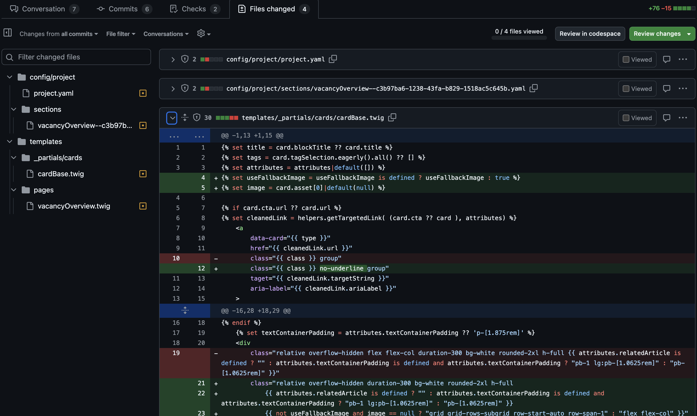

  Wat ik ook langzamerhand zorgvuldiger ging doen tijdens de stage was het lokaal testen (en dan vooral de vele edge cases) en als het op staging of een andere omgeving was gedeployed dat ik het nog een keer ging testen voordat de project manager het ging bekijken en het ticket ging afronden.

  Verder heb ik tijdens het maken van issues veel vragen proberen te stellen aan mede developers als ik niet precies wist hoe of welke kant ik op zou moeten gaan. Hierdoor heb ik meer kennis opgebouwd van wat de mogelijkheden uberhaupt zijn met de bepaalde technieken die werden gebruikt voor het project. Vue/Nuxt voor peakz en alle andere kleine projecten. En Craft en .twig voor patientenfederatie. [voorbeeld???]. Hierdoor kreeg ik het ook steeds meer onder de knie om zelf uit te kunnen vogelen wat een goede oplossing zou kunnen zijn. Maar aan het einde van mijn stage maakte ik alsnog een fout door niet goed genoeg research te hebben gedaan naar de mogelijke oplossingen. 
  Ik had namelijk een bepaald blok dat ik onderaan de pagina moest vast zetten over de hele breedte terwijl de content daarboven maar half zo breed was. Ik had gezocht naar een goede oplossing maar die kon ik net zo snel vinden. Uiteindelijk had ik een manier gevonden en koos ervoor om dat bepaalde blok (als het werd gebruikt op de pagina) vast te zetten onderin de pagina. Ik wist dat dit niet de beste oplossing was dus bleef wel zoeken naar een nieuwe. Toen ik eindelijk de mogelijkheid had om het te vragen, bleek er een veel makkelijkere optie klaar te liggen die logisch was, makkelijk te begrijpen was voor de klant, en de code netjes zou houden. Alleen had ik hem gewoon niet zelf gezien omdat ik daar niet naar had gekeken. 

  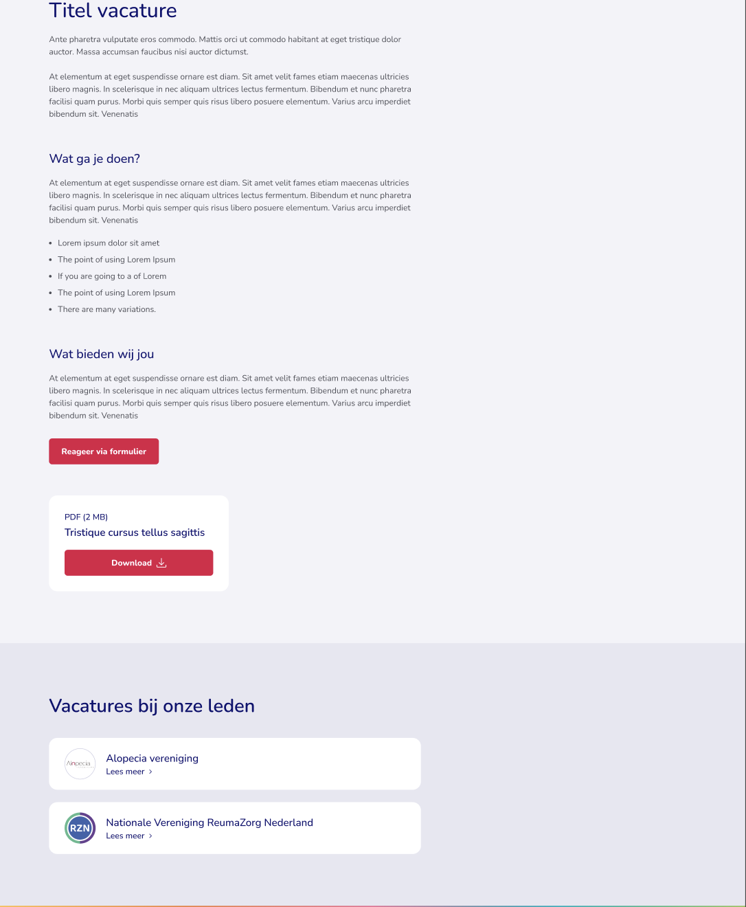

<!-- - (Begin process PFED) Kritisch gekeken naar het design om vragen en feedback te geven aan de designers. (Semantiek, foutjes, inconsistentie) (ander Font voor kleine tekstjes bijvoorbeeld) -->
<!-- - pre filled in form links voor PEAKZ (3 keer de code geevalueerd en verbeterd)
- Aspect ratio videos uit data voor PEAKZ (ook meerdere keren  geevalueerd en verbeterd)
- RSS feed verder blokken gemapt (manieren verbeterd in de macros zodat de code sneller en overzichtelijker is), tijdens het maken van een andere feature kwam nog best veel dingen tegen op de website waar we nog even naar moesten kijken qua styling. Dit heb ik opgeschreven. 
- (PFED midden) Styling foutjes uit staging gehaald
- Verder altijd kritisch gekeken naar het product op bugs en foutjes, hier tickets voor aangemaakt en opgelost.  -->

<!-- 
  - Week 5 dag 2: pre filled in form links voor PEAKZ (3 keer de code geevalueerd en verbeterd)
  - Week 7 dag 1: Aspect ratio videos uit data voor PEAKZ (ook meerdere keren  geevalueerd en verbeterd)
  - Week 7 dag 5: Code geevalueerd en bedacht dat het hier handig zou zijn om comments toe te voegen. 
  - Week 13 dag 3: Door staging gelopen en styling foutjes er nog even uitgehaald voor PFED
  -  Week 14 dag 1: Start dev sprint 4, 2de retrospective gedaan voor dit project. Hier hebben we weer feedback gegeven en gekregen. Qua feedback dat ik kreeg is dat ik soms nog iets te veel nest in de twig. En verder gewoon volgende blokken extra goed meteen op de design letten en pixel perfect werken. Design zat niet bij deze meeting maar hierover hebben we we een aantal dingen gezegd wat ons leven van de developers het een stuk makkelijker maakt volgende projecten. Ze moeten in figma in branches gaan werken. Minder design tabs. Consistent in components werken. Alle values via de values invullen en niet soms slepen enzo. Overzichtelijke pagina’s met alle values. Semantisch werken (basis html structuur kennis is handig)  
  - Week 14 dag 4: rss feed testen en evalueren
  - Week 14 dag 5: RSS feed verder blokken gemapt (manieren verbeterd in de macros zodat de code sneller en overzichtelijker is), tijdens het maken van een andere feature kwam nog best veel dingen tegen op de website waar we nog even naar moesten kijken qua styling. Dit heb ik opgeschreven. 
 -->

  ### Oriënteren en begrijpen

  **CMD’ers kunnen de context van het probleem, de wens van de gebruiker, doelstelling van de opdrachtgever, de belangen van belanghebbenden en de mogelijkheden van de technologie in kaart brengen en begrijpen.**
  
  <!-- - context, de wens, doelstelling, belangen, mogelijkheden in kaart brengen en begrijpen -->

  #### Mijn leerdoelen

  Wat ik wil leren en doen tijdens mijn stage dat aansluit aan de competentie “Oriënteren en begrijpen” zijn issues met de wens van de gebruiker en doel van de opdrachtgever te begrijpen en hiervoor een passende oplossing vinden, ook als ik al een oplossing heb gevonden blijf ik kijken of er een betere is om zo de kwaliteit van het product te verbeteren en mijn kennis te vergroten. 

  <!-- - Wens en doel begrijpen -> passende oplossing
  - Al oplossing -> kijken voor betere  -->

  #### Uitwerking

  <!-- - Oba leef en leer -> uitzetten van filters + extra dingen om gebruikers niet in verwarring te laten raken ✅ -->

  Tijdens mijn stage heb ik aan veel projecten gewerkt waar problemen en vraagstukken naar voren kwamen die ik kon oplossen. Door goed aan de opdrachtgever en gebruiker te denken heb ik voor veel een passende oplossing bedacht in de bijbehorende techniek op een nette manier. Ik heb bijvoorbeeld aan het begin van de stage een probleem moeten oplossen voor Oba leef en leer. Bij een filter optie op de website lukte het niet om op bepaalde filters te filteren. De website van Onetribe handelde alles goed af, maar het lag juist aan de service die werd gebruikt om te filteren. Die gaven namelijk geen goede url terug van de kaart met alle gefilterde locaties. Om verwarring voor de gebruiker te voorkomen heb ik in de code de betreffende filters uitgecommend (zodat dit niet opnieuw moet worden geschreven door een developer), en een comment erboven toegevoegd over waarom het is uitgecommend. 

  Daarna heb ik nog wat aanpassingen gedaan zodat:

  - De gebruiker niet verward raakt als er filters verdwijnen en nog in de url staan. 
  - De kaart altijd resultaat krijgt ook al wordt een gebroken error gebruikt. 
  - De gebruiker terug kan gaan naar zijn orginele filters op de andere pagina (geschiedenis onthouden)

  Hier moest ik wat voor experimenteren om het met zo’n klein mogelijke en goede aanpassingen voor elkaar te krijgen. 

  Uiteindelijk heb ik hiervoor een aparte functie gemaakt. Deze functie controleert of er andere filters in zitten die de map niet kan hendelen. Deze haalt hij er zo nodig uit. Daarna geeft hij de uiState weer terug. Echter had ik wel de oude uiState nodig om de geschiedenis te behouden. Dit heb ik in de updateUrlPath functie gewijzigd. 

  Ook heb ik de functie gebruikt om de uiState te cleanen zodat het niet wordt gebruikt voor gebroken filters om de map daarop te zetten. Als er bijvoorbeeld dan een alleen staande gebroken filter is dan laad de kaart niks.

  Ik had er ook voor kunnen kiezen die uit de functie te verwijderen. Maar aangezien ik toch al een functie had gemaakt om deze eruit te filteren (mede om de url en geschiedenis goed te krijgen) kan ik deze ook gewoon gebruiken. 
  Wel heb ik de filterblokken op de pagina uitgecomment voor het geval dat ze straks wel gaan werken. 

  En ik heb comments toegevoegd. Dit leek mij wel zo netjes en handig 

  

  ---
  <!-- - PFED -> slider -->

  Halverwege mijn stage was ik druk bezig met content blokken bouwen voor de klant patientenfederatie. Op de website moest ook een slider kunnen worden gepaatst maar hiervoor was geen passend blok dat bestond in tailgrids. Na wat brainstormen en deskresearch naar een goede slider kwam ik uit op het gebruiken van scroll snap samen met Alpine.js om de knoppen werken te krijgen. 

  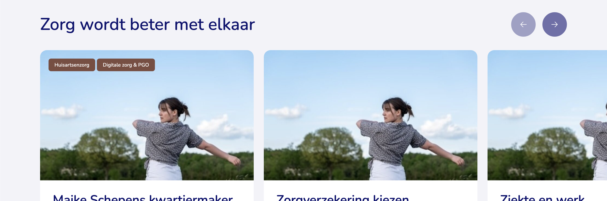

  Na nog een keer naar het design te hebben gekeken naar het design zag ik dat op mobiel er status puntjes onder moesten komen. Dit probeerde ik ook te implementeren met Alpine.js maar het bleek al snel dat het doorvoor niet echt was gemaakt. En de twig code werd hier ook erg onoverzichtelijk van. Na wat te hebben overlegt met mijn mede developer op dit project kwamen we erachter dat het misschien wel beter wat om alles om te schrijven naar normale javascript, zonder het gebruik van tailgrids. Hier stond ik ook helemaal achter en bleek al snel een hele goede optie te zijn geweest. Tijdens het opnieuw bouwen van de slider kwamen er namelijk allemaal extra user experience verbeteringen in mijn hoofd op die ik met deze manier van werken meteen kon tackelen. 
  De grootste reden dat we waren geswitched was dat je op desktop dan niet persee de knopjes zou moeten gebruiken maar ook normaal kan scrollen in de slider op desktop formaat. Maar door deze manier kon ik makkelijker de gedisablede knopjes en de status van de status-puntjes op mobiel bijhouden (ook tijdens het scrollen met gestures) en dit gelijk laten lopen. Ook kon ik maken dat als alle items in het beeld zijn, de knoppen dan allebei disabled zijn. En als je naar het eind van de slider hebt gescrolled en alle laatste items al in beeld zijn, dat de knop die naar die richting zou scrollen gedisabled wordt. De normale en actieve kleuren aanpassen van de knoppen wanneer de achtergrond kleur hetzelfde zou zijn als een van de default kleuren. 

  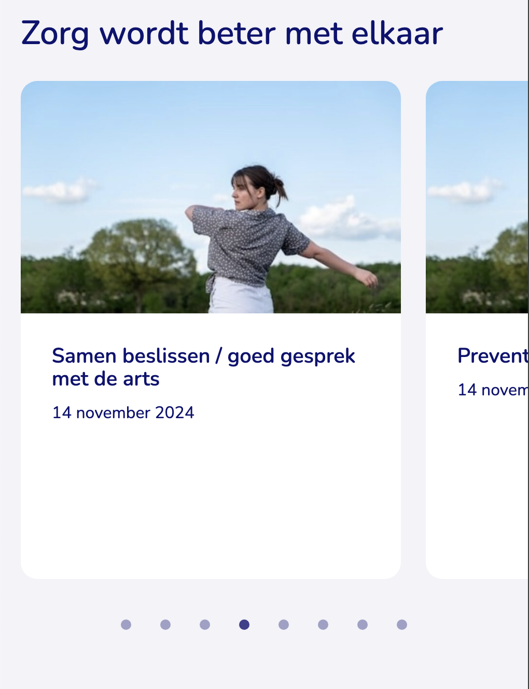
  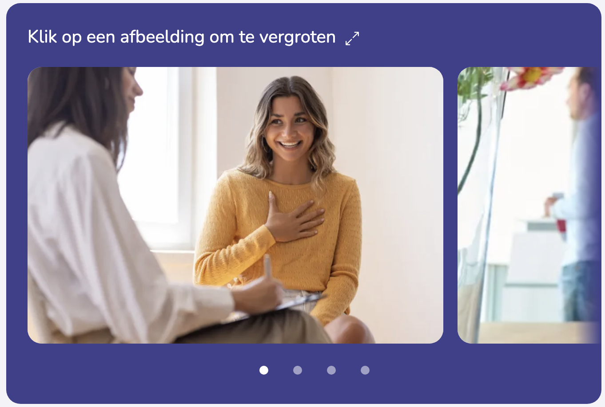

  En met javascript werd het linken van de puntjes op mobiel naar de juiste kaart ook een heel stuk handiger. Eerst gebruikte ik html links (`<a></a>`) die achorde op de list items. die kwamen wel dan altijd aan de top van de viewport, en dit was erg lelijk. Dit kon ik oplossen door op een item die er boven zweefde te anchoren maar dit gaf wel wat scroll issues. Met javascript verdween dit allemaal meteen en kon ik gewoon `carousel.scrollLeft += scrollAmount;` en `carousel.scrollLeft -= scrollAmount;` gebruiken zondar dat er iets verspringt in de viewport. 

  Hiervoor zijn we van het voorgeschreven plan en design afgestapt  etc etc....

<!-- 
  - Peakz -> ellipsis in account button header
  - RSS feed

  - Week 1 dag 3: Javascript achtige oplossing herschreven naar een meer nuxt oplossing voor peakz.
  - Week 3 dag 3: Opmerking gemaakt en kritisch gekeken naar hoe er middleware werd gebruikt in oba leef en leer en dat het netter wat zoals peakz het deed. 
  - Week 4 dag 4: Met de standup erover gehad wat er moest gebeuren met de duitse header en de overflowende account button. Hiervoor heb ik meerdere dingen voor voorgesteld zoals alleen de voornaam tonen of bijvoorbeeld met ellipsis de naam afkappen aan de hand van hoeveel ruimte die nog heeft.
  - Week 5 dag 2: Webflow slider gefixed na wat onderzoek naar de slider in webflow. (nog nooit mee gewerkt) (Voor collega)
  - Week 5 dag 3: Peakz onderzoek gedaan om de data in notion te kunnen krijgen.
  - Week 6 dag 4: Email handtekening helpen voor collega, embed video veld toevoegen in craft zodat de gebruiker videos kan toevoegen. (rijke noordzee)
  - Week 7 dag 2: Onderzoek doen naar tailgrids 
  - Week 7 dag 5: Voor oba leef en leer werkte een aantal dingen niet van externe partijen en om verwarring te voorkomen moest ik hier wat dingen aanpassen. Hier moest ik wat voor experimenteren om het met zo’n klein mogelijke en goede aanpassingen voor elkaar te krijgen. En dit is gelukt. CODE? FOTOS?
  - Week 8 dag 1: Onderzoek gedaan naar twig en craft. 
  - Week 13 dag 3: Door staging gelopen en styling foutjes er nog even uitgehaald en daarvan bepaalde oplossingen doorgevoerd en gevraagd aan Colin wat hij er van vindt. 
  - Week 14 dag 2: Mobiele slider gemaakt. Gekozen voor css snap en extra javascript toegevoegd voor het targeten van de list items, en om de dots te highlighten als je scrollt. Dit werkt ook zonder javascript en geeft extra user experience features met javascript. 
  - Week 14 dag 4: RSS feed onderzoek, hoe werkt het, wat is het, wat kunnen ze ermee en waar moet het aan voldoen. 
  - Week 15 dag 1: kritisch gekeken naar de mobiele slider en aangepast zodat het zonder tailgrids werkt, altijd kan swipen met je vinger (ook op desktop) en dat het voor meerdere sliders op de pagina werkt. 


  (Onderzoek naar craft, tailgrids, twig, vue + nuxt, logica vista) -->

  ### Verbeelden en conceptualiseren

  **CMD’ers bedenken ideeën en ontwikkelen concepten voor digitale interactieve producten, diensten, en belevingen. Ze vinden nieuwe wegen om tegemoet te komen aan wensen van gebruikers, doelstellingen van de opdrachtgever en andere belangen.**

  #### Mijn leerdoelen

  Wat ik wil leren en doen tijdens mijn stage dat aansluit aan de competentie “Verbeelden en conceptualiseren” is om kritisch te blijven kijken naar oplossingen of problemen die zijn aangekaart in issues. Hiervoor is voor mij de uitdaging om zo goed mogelijke oplossingen te bedenken die de stakeholders ten goede komen. Dit ga ik doen door te experimenteren en gebruik te maken van andere bijpassende methodes. Ook wil ik eigen ideeën voorstellen, deze onderbouwen en voorstellen aan collega’s. 

  #### Uitwerking

  Aan het begin van mijn stage heb ik op Peakz padel gewerkt die bijna live ging. Peakz padel kreeg 2 websites, een duitse en een nederlandse. Met dezelfde codebase hoefde alleen de vertalingen nog worden toegevoegd door een vertaler. En aangezien .nl eerder live ging dan .de kwamen de vertalingen ook best laat in het proces. Dit zorgde ervoor dat er in de navigatie balk weinig ruimte overbleef voor andere knoppen zoals je account knop door de lange duitse woorden. Belangrijk was wel dat de button het meest van zijn tekst behoudde want dit gaf aan of je in je account zat of dat je nog moest inloggen. Een aantal oplossingen die ik voorstelde was het gebruik van ellipsis (uitleg...), het wrappen van de navigatiebalk of woorden in de navigatiebalk als die te lang werd en of alleen de voornaam tonen in plaats van de volledige naam. 

  

  Hier ben ik even mee bezig geweest en heb de verschillende manieren geprobeerd. Het wrappen van de woorden op bepaalde breakpoints scheelde al heel veel en zag er ook niet heel verkeerd uit. Uiteindelijk is hier een combinatie ontstaan van het wrappen van woorden en ellipsis gebruik vanaf een bepaald punt voor je account button.

  

  <!-- - Meerdere oplossingen voorgesteld over een te lange button met je eigen naam die naar je account gaat op de PEAKZ website. -->

  Halverwege mijn stage kreeg ik de opdracht om de logica van een formulier voor vista hypotheken werkend te krijgen en te verfijnen. Er was namelijk een verzoek vanuit de klant om een formulier structuur wijziging door te voeren, hiervoor was een vraag in het formulier nodig die 3 keer genest werd en dat kon het formulier niet aan, dus moest daar nieuwe logica voor geschreven worden. Hiervoor moest ik goede oplossingen bedenken die de user experience aanzienlijk zouden verbeteren. Waar ik ondeandere rekening mee moest houden was: extra lagen toevoegen aan het formulier en die velden kunnen tonen, de extra velden kunnen valideren voor onder onder andere meerdere type vragen (radios, checlboxes, text) in de diepere lagen, geneste antwoorden kunnen verwijderen als je een laag erboven iets veranderd en error meldingen voor die geneste velden kunnen laten zien. Ook moest ik rekening houden voor de validatie dat als gebruikers zich bedenken, antwoorden kunnen zijn ingevuld op plekker waar dat niet moet. Deze moet ik dus tijdens het invullen van het formulier in de gaten houden en verwijderen als het nodig is. 

  <!-- - Vista logica (kritisch naar het formulier gekeken en features erbij gebouwd die nog niet bestonden zoals: extra lagen toevoegen aan het formulier en velden kunnen tonen, de extra velden kunnen valideren (voor meerdere types in de diepere lagen), geneste antwoorden kunnen verwijderen als je een lag erboven iets veranderd, error meldingen voor die geneste velden kunnen laten zien, ) ook nog de code geoptimaliseerd. -->


<!-- `juiste positie? -->
  Na vista ben ik mee gaan werken aan de website voor patientenfederatie. Uit patientenfederatie kwam het verzoek om ook een rss feed te maken. Deze hebben ze ook nog op hun oude website en sommige externe partijen gebruiken deze feed nog. Om hun webisites niet kapot te laten gaan moest ik de rss feed zo bouwen dat het nagenoeg hetzelfde werkt, alleen dan met andere content. Ik had nog nooit een rss feed gebouwd en al zeker niet in zo'n omgeving waar de website er technisch uit ziet als een blokken doos. Uiteindelijk kostte dit wat onderozoek doormiddel van deskresearch en trial and error om dit te maken en daarna wat onderzoek doormiddel van vergelijken om het op dezelfde manier op te zetten als de rss feed die ze al hadden. 

  <!-- - rss feed (nooit eerder gemaakt, zeker niet in een nieuwe taal op deze manier met blokken) -->

<!--  
  - Week 1 dag 3: stukje typescript schrijven, na wat evalueren de javascript achtige code meer naar typescript geschreven, code die er al was herbruikt, en zag dat de code hierdoor een aantal code duplication kreeg, ik verzon hiervoor een oplossing maar wilde eerst vragen aan mijn collega developer of er geen helper functies hiervoor zouden moeten worden gemaakt. Antwoord: ja dat kan, is niet nodig voor deze sprint.
  - Week 4 dag 4: Meerdere oplossingen voorgesteld over een te lange button met je eigen naam die naar je account gaat op de PEAKZ website.
  - Week 5 dag 2: Ik had een oplossing bedacht voor de pre filled form links, en liet Wiebe dat zien. Wiebe zei dat dit ook te snappen zou moeten zijn voor de klant (aangezien content beheerders ook dingen in het cms veranderen, en als er dan een nieuw formulier komt moet de content beheerder deze stappen doorlopen zondar dat die enig verstand heeft van url's enzo) Ik evalueerde mijn oplossing en zag dat de oplossing voor de meeste zeker te snappen is, maar niet voor iedereen. Ik legde het uit aan de pm'er aangezien een betere oplossing tijd zou kosten. De pm'er vond de oplossing te snappen en goed genoeg, er moet desnoods een beetje documentatie bij van 2 regels. 
  - Week 6 dag 4:
  - Week 7 dag 5: Filter opties uitzetten voor oba leef en leer, en dit mooi afmaken met user friendly oplossingen na er kritisch naar hebben gekeken. 
  - Week 8 dag 1: tailgrids blokken voorbereiden
  - Week 9: vista logica (kritisch naar het formulier gekeken en features erbij gebouwd die nog niet bestonden zoals: extra lagen toevoegen aan het formulier en velden kunnen tonen, de extra velden kunnen valideren (voor meerdere types in de diepere lagen), geneste antwoorden kunnen verwijderen als je een lag erboven iets veranderd, error meldingen voor die geneste velden kunnen laten zien, ) ook nog de code geoptimaliseerd.
  - Week 14: rss feed
  -->


## Observatieopdrachten

<!--
Beschrijf kort welke observatieopdrachten je hebt
uitgevoerd. (denk aan het documentje Observatieopdrachten). Geef aan wat je hebt
geleerd en hoe dit heeft geholpen bij het behalen van je leerdoelen. 
-->

Voor de drie observatieopdrachten wilde ik onder andere stand-ups bijwonen, een livegang bijwonen en een kick-off/ start development proces van een project bijwonen. Dit is allemaal gelukt. 

### Standups

Ik heb veel standups bijgewoond waar verschillende functies bij aanwezig waren. Daarbij heb ik goed opgelet, geluisterd en input gegeven. Daarnaast vinden er ook veel gesprekken op de wwerkvloer plaats waar dingen worden besproken over projecten, volgende moves en statussen. Deze heb ik ook gezien, bijgewoond, en zelf gestart. Hierdoor heb ik een goed beeld gekregen over de samenwerking en communicatie op de werkvloer binnen het team en hieraan zelf ook meegedaan en zelf geoefent. Communicatie is key, je kan beter iets te veel zeggen dan te weinig. Wat ze met die informatie doen is niet jou probleem. Wel is het handig om de tijd van een ander te respecteren en bijvoorbeeld meerdere vragen tegelijkertijd stellen in person of in de mail. Hierdoor wordt de persoon niet onnodig meerdere keren uit zijn flow gehaald. 
Wat er besproken wordt in de standups is vaak of er nog meer informatie is van de klant, statussen van tickets van de developers naar de pm'ers.

<!-- - Ook wil ik graag een sprint voor de livegang en de livegang zelf bijwonen. Zo kan ik antwoord krijgen op hoe gaat dit in zijn werk, hoe werkt iedereen voor een bepaalde deadline, hoe gaat de communicatie tussen de klant, externe stakeholders, project managers en developers. Komen er nog veel dingen bij als je eenmaal live bent gegaan, dingen waar klanten nog op komen of niet chill vinden nadat ze live zijn gegaan.  -->

### Livegang

Livegang van bepaalde websites heb ik ook zeker gezien, en zelfs zelf gedaan. De grootste livegang was die van peakz padel. Deze website zat in totaal al een jaar in het development traject en aan het einde is er steeds meer focus op gekomen. Dit kwams onder andere doordat er een definitieve datum was wanneer er banen kwamen in duitsland en voor die tijd moest de webiste af. Uiteindelijk is die in de 5de week van mijn stage live gegaan. Eerst Nederland (deze was het spannendst) en daarna Duitsland (dezelfde source code, alleen andere content). Dit ging allemaal makkelijker dan verwacht. Voor de livegang was er nog een spoed overleg omdat er peformance issues waren (onnodig data verkeer). Dit zou ervoor zorgen dat de site er snel uit zou liggen als er veel bezoekers op zouden komen. Uiteindelijk is ervoor gekozen om de livegang alsnog door te laten gaan en in Heroku (waar de website wordt gehost) een quick fix te doen waardoor de server scaleable is en deze hoeveelheid dataverkeer dus aan kan. Dit kwam wel met een kosten plaatje van 3500 euro per maand dus dit moest snel gefixed worden. 
Colin en Wiebe hadden de laatste dingen naar master gemerged. En Tim en Stef gingen het stappenplan van Job doorlopen om de website op productie te krijgen en te koppelen aan de DNS records. Na de livegang zaten de pm'ers op te letten of de website het goed deed en hielden contact met de klant. Ondertussen waren Colin en Wiebe de website aan het optimaliseren en ik was andere bugs aan het oplossen. Een aantal dagen later was dit allemaal opgelost en kon Duitsland live. 

<!-- - En het liefst zou ik een kick off van een project bijwonen, een beginnend project in kijken of de start van het development traject willen bijwonen of aan mee werken. Zo krijg ik meer inzicht over hoe het vanaf het begin in zijn werk gaat, door welke handen zulke projecten gaan voordat het live gaat.  -->

### Kickoff

Ik heb ook een kickoff van een nieuw project bij kunnen wonen. Dit project begint aan zijn development traject nadat het door de discovery, concept en bijna de design fase is gelopen. Deze kickoff begon met een meeting onder de developers zelf samen met een pm'er om deze dingen te bespreken:

- Het concept te bespreken
- Wat het is **=>** (15 websites naar 1 webiste, veel content, geen lastige styling, blokken bouwen, wel veel clickouts)
- Welke tech stack **=>** Craft blokken bouwen, twig templating language, styling tailgrid, (1 tool waar vue voor wordt gebruikt (alleen ingelanden op die pagina))
- Wat belangrijk is **=>** pagespeed, accessability en de grootste uitdaging is het goed opzetten van de craft structuur zodat het voor de klant en content beheerders het makkelijk is om overizichtelijk content te beheren. 
- Taak verdeling
- Planning
- Deadline
- Eerste taken
- Doelen 

Verder werd er besproken hoe ze het willen bouwen, nieuwe dingen zoals (craft 5, tailgrids, algolia ook relatief nieuw voor veel developers)

Uiteindelijk moest ik even onderzoek doen naar Tailgrid. Hoe werkt het en wat heeft het.
Het bestaat eigenlijk uit templates en components die gemaakt zijn met tailwind. De installatie is makkelijk. Tailgrid heeft ingebouwde functies om bijvoorbeeld classes te togglen en `:class=""` toe te voegen aan de hand van een boolean etc. Dit scheelt javascript schrijven. Qua menging met twig is het makkelijk want alle data gaat zo: `{{{ data.iets }}}` en twig heeft ook loop functies, verder is het allemaal html waar je de tailwind classes op kan zetten. Design gebruikt ook tailgrids dus dat is ook makkelijk want dan kan je de gekozen tailgrid components opzoeken, kopieeren en customizen. 

Daarna heb ik nog vragen gesteld over algolia en craft aan Colin. => Beter beeld over wat er gedaan moet worden voor hun. 
In craft staat alle content, dat wordt gelinked met algolia, dat wordt ingeladen op de website en kan makkelijk en snel zoeken in wat in algolia staat. Verder gevraagd over wat ze denken te doen in craft. Sections in sections kunnen niet. Entries (soort pagina's) en reusable entries (herbruikbaare pagina's) bestaan ook. Verder vindt Tim het niet echt een goed idee om een tag op pagina's te zetten onder welke omgeving die moet komen, er zijn namelijk drie omgevingen met secties die pagina's bevatten. En in die omgevingen zijn een aantal secties hetzelfde, en je wilt geen dubbele pagina's maken. Ik zei dus tegen Colin of hij die niet als reusable pagina kon maken en die dan op meerdere pagina's kunnen gebruiken. Hij zei dat dat kon maar dat het niet echt zo werkt. 

Verder hadden we de volgende dag nog twee andere meetings waar ik bij kon zitten. Deze meetings waren met design en UX en daar werd vooral de focus besproken voor nu. Ook werden de wireframes en informatie structuur doorlopen en werden er punten opgesteld terug naar de klant waar op sommige punten stevig druk op moest worden gevoerd. Dit komt omdat de klant vaak laat is met dingen aanleveren of feedback geven. 

Ook werd er gegeken of ze dingen aan het concept konder tweaken waardoor het werk scheelt, en het beter is voor de gebruiker. 

Ook werd er discussie gevoerd over bepaalde beslissingen met betreft opzet CMS omdat dit veel gevolgen gaat hebben op uren en hoe de klant straks content beheert. 

> Week 1 PFED = Job (backend developer) heeft craft, sentry, heroku (productie, staging) en AWS opgezet en gelinked. Colin heeft de structuur van craft uitgedacht in excel en gespard met Raoul hiervoor. Ook heeft hij de eerste structuur gemaakt met code en vooral getest of dingen werken of niet. 

> Week 2 PFED = Start sprint 1, nog steeds veel meetings. Design presentatie, issues gemaakt aan de hand van de TA. 

> Week 3 PFED = Laatste feedback punten, klant is laat met feedback, cms logica is al in de maak,

> Week 4 PFED = Klant nog steeds geen akkoord op informatie architectuur, verder is er al wel begonnen met het bouwen (voorzichtig en voorbereidend) maar als het akkoord langer op zich laat wachten kan er niks worden gedaan. Nu vindt de klant dit niet zo erg, maar voor Onetribe is dit wel naar, aangezien zij dan langer met een project bezig zijn en in die tijd al een nieuw project hadden kunnen aannemen. 

## Analyse feedbackformulieren 

<!-- 
Maak een analyse gebaseerd op de je
functioneringsgesprek en de feedbackformulieren van halverwege en het einde van
je stage. Wat valt je op? Hoe kijk je aan het einde van de stage terug naar je stageplan
en het functioneringsgesprek halverwege? 
-->

**Midden:**

- (+) Werkt goed door, haalt veel tickets binnen het bepaalde timeframe
- (+) toont technische vaardigheden, inzet en zelfstandigheid.
- (+) houdt constant rekening met de wensen van de gebruiker en klant met betreft accessibility en ux. 
- (+) neemt initiatief, is leergierig en flexibel
- (+) bijna geen onderscheid tussen code, pr's en branching vergeleken met collega's
- (-) nog wat afwachtend op pr's, mag wel wat meer vragen of iemand bijvoorbeeld iets wil deployen of reviewen.
- (-) kan iets kritischer zijn op styling in de fijne details
- (-) iets nauwkeuriger zero en error states testen.
- (-) Mondelinge communicatie aandachtspunt
- (-) Mag soms wel wat meer naar de voorgrond treden. 

**Functioneringsgesprek:** 

- Focussen op communicatie skills waardoor het nog makkelijker en leuker wordt om met mij samen te werken. Denk bijvoorbeeld aan dingen aanleveren samen met je vraag zodat de persoon waaraan je het vraagt bijvoorbeeld alleen hoeft te kiezen, ja of nee hoeft te antwoorden, of makkelijker je vraag kan beantwoorden. En ook meer proberen in te brengen in meetings. 

**Eind:**

- (+) Houdt rekening met verschillende stakeholders
- (+) Werkt goed door, haalt veel tickets binnen het bepaalde timeframe
- (+) Neemt initiatief met het aandragen van verbeterpunten
- (+) Kan goed zelfstandig werken, secuur en technisch bekwaamd genoeg voor technische tickets
- (+) Constructief en duidelijk gecommuniceerd -> collega's, standups, klanten 
- (+) aanvulling op het team
- (+) Haalt input waar nodig
- (-) opmerkingen in tickets waren soms een beetje onduidelijk.
- (-) iets te weinig naar voren treden in de vergaderingen.

### Wat valt je op?

Wat mij opvalt is dat ik nog zeker wel wat verbeterpunten had halverwege en dat erg verminderd is richting het einde. Je ziet dat heb gefocused op het achter na gaan van mijn pr's en vragen waar nodig als ik iets nodig had. Ook heb ik geprobeerd kritischer te gaan kijken naar de zero en error states en gedetaileerde styling van blokken. En heb ik geprobeerd mijn mondelinge communicatie te verbeteren. Het enige wat bij beide feedback punten en het functionerings gesprek nog naar voren kwam is het naar de voorgrond treden in meetings. Hier ben ik mij ook bewust van en staat nog steeds op mijn lijstje om te verbeteren. 

#### Hoe kijk je aan het einde van de stage terug naar je stageplan en het functioneringsgesprek halverwege?

Als ik zo terug kijk naar mijn stageplan heb ik denk ik best realistsiche leerdoelen geformuleerd die specifiek waren maar ook ruimte toelieten voor onvoorziene omstandigheden waarvan ik ook veel kon leren. Je weet namelijk nooit wat je precies allemaal gaat tegen komen en doen op zo'n stage waardoor het extra lastig is om specifieke leerdoelen te stellen. Een groot leerdoel wat wel steeds terug kwam in de feedback formulieren en het functioneringsgesprek waren de communicatieve vaardigheden. De mondelinge communicatie, communicatie naar collega's met weinig verstand van code, behulpzame communicatie om de andere partij minder te belasten en te helpen om jou te kunnen helpen en het voortreden naar de voorgrond op de werkvloer en meetings horen daar allemaal bij. 
Hier ben ik zeker in gegroeid, ik weet nu hoe ik bepaalde situaties moet aanpakken en als ik hier nog een tikje extra aandacht aan geef gaat het meeste gewoon goed. Het enige waar ik vooral nog tegen aanloop is het naar voren treden in meetings, maar hier vertel ik meer over in de reflectie. 

## Reflectie

Wat goed ging of zelfs beter dan verwacht was voornamelijk het leren van nieuwe systemen en programmeer talen, het kritisch kijken naar wat ik oplever, inleven in klant en gebruiker qua wat zij verwachten en zullen gaan begrijpen. Wat ik anders had willen aanpakken deze stage is denk ik tog wel iets eerder dingen vragen. Ik heb soms gemerkt dat ik iets te vaak in een probleem vast bijt terwijl er een developer in de buurt is die vaak snel het antwoord wel weet. Maar dit geldt ook voor meetings als ik bijvoorbeeld iets niet snap. 

Mijn grootste kwaliteit is dat ik zeer kritisch blijf op wat ik oplever, door zoek naar betere oplossingen en ander manieren en hiervan blijf leren. Dit kan negatieve gevolgen hebben, maar hierdoor werk ik wel erg secuur en dit komt vaak het product ten goede. Andere kwaliteiten die ik deze stage zag terug komen zijn bijvoorbeeld dat ik durf fouten te maken, vragen te stellen en feedback te vragen en hier snel van leer. Mijn grootste beperking is toch nog wel mijn communicatie vaardigheden. Normale communicatie face to face of via chats gaat gewoon goed, maar in gesprekken met grotere groepen heb ik vaak nog moeite om er tussen te komen. Ik ben een hele rustige jongen die veel en goed kan nadenken maar het omzetten naar woorden gaat soms nog wat stroef en langzamer dan de rest. Hierdoor verlies ik vaak de kans om mijn mond open te kunnen trekken terwijl ik dat wel wil, omdat dit gewoon simpelweg te lang duurt. Het maakt het natuurlijk ook een stuk makkelijker als je het onderwerp waarover wordt gesproken goed kan plaatsen in de context. Tijdens de stage ben ik hier wel beter in geworden, heb ik dit vaak kunnen laten zien tijdens standups en soms tijdens development en desing meetings. Maar dit heeft gewoon simpel weg meer tijd en oefening nodig dan ik had tijdens mijn stage. 
Wat ik wel heb kunnen verbeteren aan mijn communicatie vaardigheden is dat ik nu beter kan communiceren met functies die weinig af weten van code, en ik probeer het makkelijker voor mensen te maken als ik iets van ze nodig heb. Dit kan feedback zijn of bijvoorbeeld een vraag over welke richting ik op moet gaan. Dit was laatste was een feedbackpunt vanuit mijn functionerings gesprek en heb ik bijvoorbeeld kunnen laten zien tijdens een feedback ronde met een designer waar ik testlinkjes voor had gemaakt.

Tijdens mijn eerste stage zat ik bij een klein bedrijf waar je met z'n allen zogenaamd in een woonkamer zat te werken. Tijdens deze stage wilde juist een ander soort bedrijf vinden, eentje die groter zou zijn met veel meer verschillende afdelingen en functies bij elkaar. Deze keuze heeft mijn beroepsperspectief aanzienlijk verbreed. Dit gaf mij niet alleen inzicht in hoe grotere bedrijven in elkaar zitten maar ook de kans om aan meerdere projecten mee te kunnen werken. Ik kon actief meedoen aan meerdere fases van grotere projecten, en vaak deelnemen aan veelzijdige meetings met veel verschillende expertises bij elkaar. Dit allemaal heeft ook mijn kennis over projectmanagement en samenwerking vergroot. 

## Bijlagen

<!-- 
- Je stageplan
- Alle feedbackformulieren, dus die van het tussentijdse gesprek en die van het eindgesprek
- Eventueel in detail beschreven (deel)producten die je hebt gemaakt.
- Eventuele andere verslagen van vergaderingen, interviews, observaties of anderszins
- relevante stukken. Omvang: ca. 20-25 pagina’s exclusief de bijlagen. Let op dat je beknopt en bondig schrijft en maak goed onderscheid tussen wat bij je verslag hoort en wat een bijlage is.

(Een bijlage is een aanhangsel aan het originele werk waarin je informatie vindt die
ondersteunend is maar in de hoofdtekst te veel zou afleiden.)
-->

 ### Git flow

  Om de versie beheer goed inzichtelijk te houden maken ze gebruik van git flow.
  Je zet `feature/`, `hotfix/` of `release/` voor de titel van je branch als je die cloned en de titel van je commit is eigenlijk vaak ook je issue nummer. Welke het meest wordt gebruikt is `feature/`.
  Voor de semantic release (het versienummer van je project die je automatisch kan updaten aan de hand van hoe je je commits opbouwt) moet je je commits beginnen met chore:, fix:, feature: of perf:. 
  voorbeelden:

  

  > Bron: https://www.atlassian.com/git/tutorials/comparing-workflows/gitflow-workflow 

  Ook zei Raoul dat niet iedereen zich aan de standaard van git flow houdt en vind dat je je gewoon aan de standaard moet houden en niet dingen er bij moet verzinnen die je dan eerst weer moet uitleggen. 

 #### Git flow deployment 

  Nadat ik een feature had gebouwd voor DRN heb ik samen met Raoul DRN kunnen deployen naar productie (de website die live staat). Dit mocht na een GO van de klant. Eerst moesten we een nieuwe versie releasen om de versie tag up te daten. Deze werd v2.1.0 aangezien er een commit met feat: (feature added) begon en moesten we handmatig schrijven aan de hand van de git flow. Dit kan automatisch worden gedaan maar aangezien github soms dingen meeneemt die niet de bedoeling zijn hou je het hier mee in eigen hand. Daarna hebben we een pull request gemaakt van `develop` naar `master`. Hierin stonden stappen die we moesten doorlopen voor deze deploy en dat waren: 

  ```
  - [x] Nieuwe versie tag: vX.Y.Z
  - [x] Backup van productie database downloaden (evt. minus activity logs content)
  - [x] Nieuwe env variabelen? Op productie dyno instellen (check: .env.example)
  - [x] PR aanmaken van [acceptance|develop|release]-branch naar [main|master]
  - [x] Nieuwe Node versie? Set node versie in buddy action “Execute yarn lint. semantic release” (check in .nvmrc & package.json)
  - [x] Productie deployen (via BuddyWorks/Heroku)
  - [x] Na deployment In het CMS de nieuwe velden voorzien van teksten (popup titels, beschrijvingen, etc.)
  - [x] Eventuele Freeform formulieren aanvullen met nieuwe velden
  - [x] PR mergen
  - [] Branches Cleanup (alleen master, develop en feature-branches over?)
  - [x] Backmerge Master
  ```

  De eerste stap was dus het aanmaken van een nieuwe versie tag doormiddel van semantic release, alleen dan handmatig. Daarna maakte Raoul een backup van de database, dit is belangrijk voorals de deployment fout gaat, dan kan je het namelijk altijd terug zetten. Nieuwe env's hadden we niet. PR hadden we ook gemaakt. We hadden geen nieuwe Node versie dus die konden we ook overslaan. Daarna heeft Raoul de `develop` branch gedeployed in BuddyWorks. 
  Terwijl het aan het deployen was liet Raoul mij Cypress zien waarmee je met bepaalde scripts heel snel websites (vooral de basis functionaliteiten zoals of zoeken werkt en of je geen lege lijst krijgt bij een bepaalde pagina) kan testen. Hij raadde mij dit wel aan om in te duiken. 
  Daarna was het geployed en konden wij `develop` naar `master` mergen. Daarna moesten we nog een backmerge doen van `master` naar `develop` om 100% zeker te zijn dat alles changes die in master zitten ook in develop zitten (denk aan hotfixes of iets dat nog niet is gemerged naar develop). 

  Na de deploy even gekeken of het allemaal goed werkte op productie daarna weer doorgegeven aan Lars. 

  Content kon ik al toevoegen maar aangezien de klant juist de optie wilde om daar een video te plaatsen heb ik dat niet gedaan, Lars uiteindelijk wel. 

  Ook had ik een GO gekregen om oba-congres op productie te zetten. Hier heb ik een pr voor aangemaakt van `develop` naar `master`, en nadat Colin de pr goed heeft gekeurd, op buddy de deploy heeft gedraait (Hier hoefde geen backups of iets voor gedraait te worden aangezien het een singlepage website is zonder database of iets) kon ik een release aanmaken `v1.2.2`. Colin vroeg zich nog af of het niet `v1.3.0` moest zijn maar ik zei dat het inprincipe alleen maar content changes zijn voor de gebruiker en dit voegt verder geen extra features toe en daar was hij het mee eens. 
  <!-- [screen shots] -->

 #### Merge regel

   Bij Onetribe is er een regel dat je je eigen branch merged. Dit is een regel die bij mijn minor bij de HBO ICT het tegenovergestelde was. Daar gelde je merged meteen de branche die je hebt geapproved, als er iets fout is aan de changes, dan zijn jullie allebei verantwoordelijk. Aangezien degene die het approved en mergen goed had moeten testen en reviewen. 

   Bij Onetribe geld dat niet. Hier maak je een pr, deze wordt gereviewed, feedback gegeven of approved en dan mag je hem daarna zelf mergen. Dit geeft als gevolg dat de reviews niet uitermate wordt getest en vooral wordt gekeken naar de kwaliteit van de code. Wel is dit sneller qua reviewen, is alleen degene die het heeft geschreven verantwoordelijk maar geeft mogelijk wel meer kleine (over het hoofd geziende) issues later omdat 1 persoon mogelijk meer fouten maakt dan 2 mensen bij elkaar. 

   Wel is dit natuurlijk een professionele omgeving waar iedereen op een redelijk niveau codeerd en niet zoals op school waar een deel er niks van begrijpt en je juist van elkaars code ook wil leren.

 ### Code enviroments & andere tools

  Bij Onetribe gebruiken ze Bitbucket en Github om hun code op te slaan. Dit verschilt per project door de fusering met noProtocol. 

  - Jira -> Issue boards
  - Sentry -> Website monitoring (debug, errors)
  - Algolia -> Search
  - Dato of Craft cms -> content management system
  - Heroku -> Hosting
  - Akamai -> Cache
  - Screamingfrog -> SEO testing, (Maar voor peakz hebben ze een SEO man ingehuurd om tips te geven)
  - Extra widgets zoals FOYS of localfocus -> hiermee komt vaak de klant mee aanzetten. Hier kiest Onetribe dus niet perse voor, en hebben dus ook vaak problemen door bugs bij de andere partij.
  - Buddy.works tussen iets om websites te deployen/hosten

 ### Vue.js/Nuxt.js Onetribe

  Veel projecten maken gebruik van het Vue.js/Nuxt.js framework. Dit was helemaal nieuw voor mij dus dit was erg interessant. 
  Wat ik meteen al zag is dat dit erg component based wordt geschreven. Je hebt pages, en die bestaan uit components, en sommige components bestaan weer uit andere components. Door data door te geven en te kijken of bepaalde dingen moeten worden ingeladen als het nodig is, kun je dus met dezelfde componenten verschillende pagina's maken, zonder veel code duplication. Ook hebben deze componenten hun eigen component based styling en scripts. 
  <!-- meer voorbeelden en code hieronder -->

  Wat ik veel heb gebruikt in vue wat aansluit op de vue manier van code schrijven zijn:
  - Computed properties
  ```js
  const trueOrFalse = computed(()=> {
    return eenArray.lenght > 1;
  })

  console.log(trueOrFalse) // functie wordt uitgevoerd als je de variabele gebruikt, logt true of false
  ```

  - props doorgeven aan een component: 
  ```js
  <component
    :ditIsEenProp="trueOrFalse"
  >
  ```

  En in het component kan je dan zo de props inzien:

  ```js
    const props = {
      ditIsEenProp: boolean;
    }
    console.log(props.ditIsEenProp) // dit logt true of false
  ```

  - v-if en v-for 
  ```js
  <component
    v-if="ditIsEenProp" v-for="nestedGroup in groups"
  >
  ```

  - v-html
  - slot

  ```html
    <slot name="search-results" />
  ```

  en in het component erboven:

  ```html
    <template 
          #search-results
        >
          <ais-hits>
            <template #item="{ item }">
              <search-hits-item-learning-materials :item="item" />
            </template>
          </ais-hits>
    </template>
  ```

  Wat makkelijk hieraan is is dat je veel overzicht kan behouden in een file qua wat er allemaal in zit. Maar de logica en styling staat op het component zelf. Ook kan je op verschillende pagina's het component search results gebruiken terwijl je er andere dingen in kan zetten per pagina. Dit scheelt logica in het component zelf. 

 ### Opzetten projecten 

  Tijdens mijn stage heb ik een hoop projecten moeten opzetten om daaraan te kunnen werken. Dit vond ik lastiger dan developen aangezien het vaak niet meteen werkt, niet alle error meldingen duidelijk zijn en je kennis nodig hebt om mogelijk te kunnen zien waar het aan ligt. Ook moet je alle stappen doorlopen en is dit niet altijd goed gedocumenteerd omdat ik vaak op edge cases terecht kom. Hier heb ik veel van geleerd, denk bijvoorbeeld aan hoe het werkt, de stappen die je moet doorlopen, errors herkennen, de benodigdheden weten (bepaalde talen, databases, lokale server). Door al dit vaak te hebben gedaan, veel hulp te hebben gekregen en vragen te stellen ging dit opzetten steeds soepeler en zelfstandiger, en snapte ik ook beter hoe die projecten in elkaar zaten. 

  De systemen die Onetribe gebruikt om servers op te zetten en databases te runnen zijn Laravel herd, DBengine en tableplus. Dit heb ik werkend kunnen krijgen met wat hulp voor het project Oba leef en leer waarvoor dit nodig was. Een tijdje later moest ik de rijke noordzee opzetten hiermee maar dat lukte niet zelfstandig. Uiteindelijk heb ik hier de hulp van Raoul voor gekregen. Maar Raoul gebruikt ddev (docker) en dat maakt twee docker containers voor de database en craft (cms). Uiteindelijk werkte dat voor de rijke noordzee maar bleek later dat laravel herd het niet meer deed, dit heb ik ook niet meer aan de praat gekregen met hulp van meerdere mensen. 

  Uiteindelijk heb ik alle projecten daarna draaiend gekregen met ddev, niet alleen, vaak met hulp. Dit kwam omdat ik dan tegen errors kwam waarvan ik niet wist hoe ik die kon oplossen. Hierdoor heb ik de stappen en benodigdheden vaak kunnen observeren en onthouden. En uiteindelijk had ik geen hulp meer nodig. De dingen waar ik op moet letten als ik een project op start zijn:

  - Alles in de env moet goed staan.
  - Craft moet eerst runnen want anders kan je de fe niet builden want nuxt voert queries uit om te kijken of alles kan wat die wilt doen en als dat niet kan gaat er iets niet goed. 
  - Je moet een database krijgen van je collega's anders kan de code niks vinden. 

  <!-- verdere feitjes: Nuxt draait op localhost nadat die is gebuild. 
  Craft kan headless maar hoeft niet. Headless: draait op een andere server. Kunnen elkaar wel bereiken, andere url. -->

  <!-- // TODO [Tekening maken] -->

  **Plug-in installeren in craft (cms)**

  Uiteindelijk moest ik een andere dag een plugin installeren in craft. Deze plugin zou moeten zorgen voor extra beveiliging wanneer je een wachtwoord aanmaakt. 
  Het project draaide al lokaal en na de documentatie te lezen probeerde ik de plugin te installeren. Dit lukte niet in een keer, ik wist niet precies waar ik het commando moest draaien en ik had wat database connection errors. Na een poos de containers uit docker uit te hebben gezet en weer aan te hebben gezet deed het commando het opeens wel. Dit had ik gepushed, maar zag dat niet alle files nodig waren om te committen. Ik had wat changes verwijderd maar raakte verstrikt tussen de verschillende versies van mijn branch en craft, ook na het opnieuw bouwen van het cms en de yaml files gelijk trekken zeurde het cms over changes die waren gemaakt in de database. Dat betekende maar een ding en dat was het project nuken en opnieuw bouwen. 
  Dit was een goede oefening om weer het proces van een project opzetten te doorlopen en lukte meteen. Mijn stappen waren dit:

  ```
  $ make nuke
  $ ddev import-db --file=./oba-leef-en-leef.sql #importeer de database die ik aan het begin van de stage had gekregen. Deze heeft nog niet de changes van mijn geinstalleerde plugin. 
  $ ddev . make build-cms # bouw het cms in een docker container
  $ make build-web # bouw de front-end
  $ make run # host de front-end op localhost (geen docker container)
  ```

  Nadat het project opnieuw was gebouwd checkte ik of de plugin in craft stond. Dit was niet het geval en kon ik dus weer opnieuw installeren. Om de database altijd te bereiken moest ik de host van mijn database uitgebreider opschrijven. Dus het werd niet `DB_DSN="mysql:host=db;port=3306;dbname=db"` maar `DB_DSN="mysql:host=127.0.0.1:3306;port=3306;dbname=db"`

  Dit kon ik zien door `ddev status` te draaien in de terminal want daar stonden dit soort gegevens. 

  Installatie van de plugin:

  ```
  $ cd cms
  $ ddev composer require "born05/craft-enforcepassword:^2.0.0" -w && ddev craft plugin/install enforce-password
  ```

  Dit lukte allemaal en installeerde alleen de benodigde files. Daarna heb ik nog een enforce-password.php file aangemaakt om de criteria van een nieuw wachtwoord te benoemen en zo nodig aan te passen. Colin wilde niet dat het wachtwoord na een aantal dagen zou expireren dus die hebben we op 0 gezet. En verder wordt alleen het laatste wachtwoord opgeslagen i.p.v de laatste vijf. Dit heb ik getest het werkte. 

  ```
  $ ddev craft users/create --admin 
  Email: testtest@test.com
  Username: jopadmin
  Set a password for this user? (yes|no) [no]:yes
  Password: 
  Password should be at least 16 characters.
  ```

  **Andere projecten**

  Alle projecten die ik daarna heb opgestart gingen veel vlotter dan daarvoor. Het meeste waar ik nog tegenaan liep was dat de `.env` variabelen niet goed stonden. Hier heb ik de andere keren extra op gelet en naar gekeken. Zo was er bijvoorbeeld redis toegevoegd door de backend developer in het patienten federatie project die ik al draaiend had gekregen op mijn computer. Maar de nieuwe changes zorgde ervoor dat het het niet meer deed. Na wat research en de error meldingen te hebben gelezen kwam ik er achter welke variabelen en files ik miste. Dit waren de `docker-compose.redis.yaml` (die stond in de `.gitignore`), de redis variabelen in de `.env` en ik moest redis op mijn computer nog installeren. Na wat experimenteren zorgde `REDIS_HOST=host.docker.internal` in de .env er uiteindelijk voor dat de redis DB connectie geopend kon worden.   